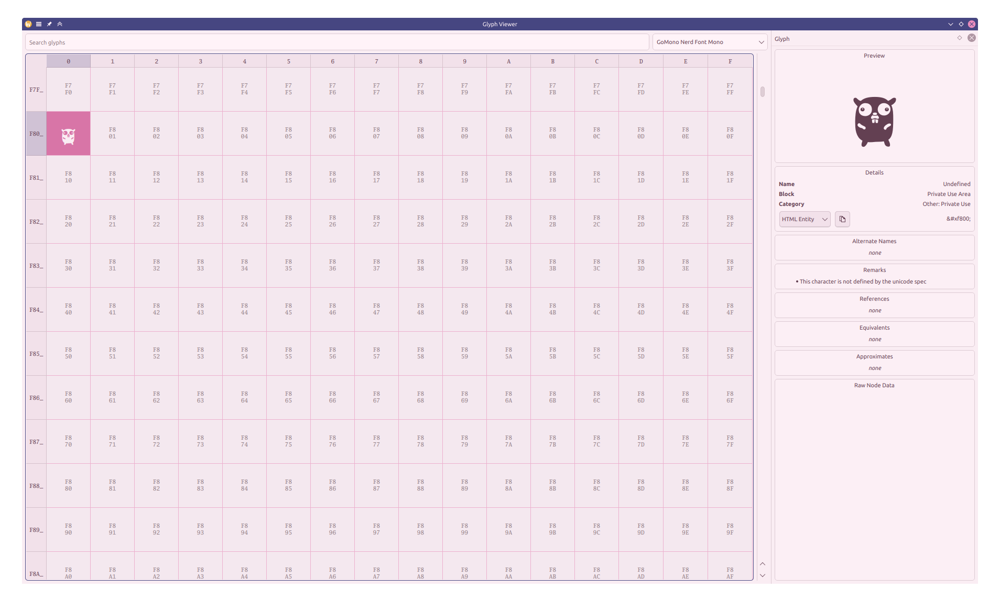
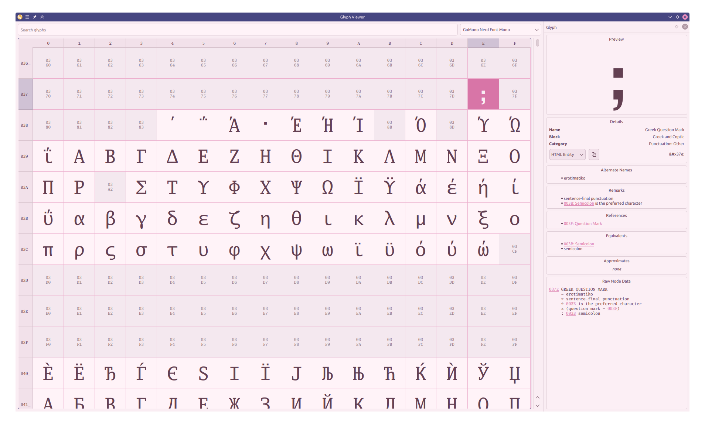
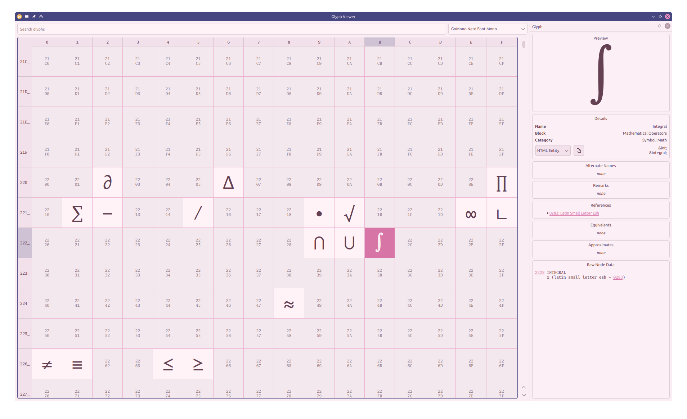

# fontview

A tool to view every damn glyph a font contains, along with plenty of useful Unicode info.

Yes, it even supports named HTML entities, like `&int;` for `∫`

> [!WARNING]
> This app is only tested on KDE. Do not raise issues about the missing copy icon.

To do:

- [x] Fast table (do not load 50k lines at once)
- [x] Installed fonts
- [ ] Custom font file
- [ ] Search
- [ ] List glyph name in font
- [ ] Reference history
